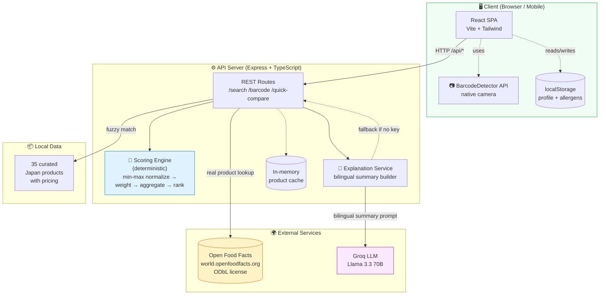
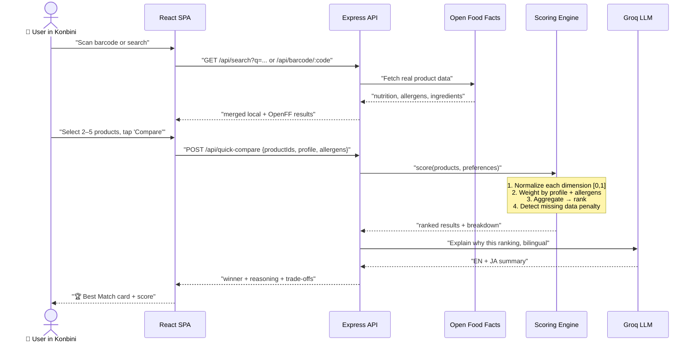
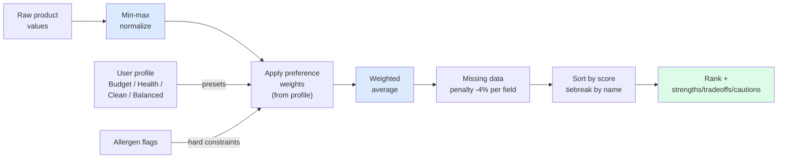

# 🍱 KonbiniCompare | コンビニ比較

**Which one should I grab? どっちを選ぶ？**

KonbiniCompare helps you make quick, confident decisions in Japanese convenience stores. Search or scan any product, compare two items, get an instant personalized verdict with honest trade-offs.

---

## 🌟 How It Works

1. **Search or Scan** — Find products by name, brand, Japanese text, or scan the barcode with your phone
2. **Compare** — Pick 2 products and tap "Compare Now"
3. **Decide** — Clear winner with a one-sentence explanation and trade-offs

Your preferences are set once in a profile (Budget / Health / Clean Ingredients / Balanced) — no sliders to configure every time.

---

## ✨ Key Features

- **🔍 Search-first UX** — Find products by name, brand, or Japanese text
- **📷 Barcode Scanner** — Point your phone camera at any barcode for instant lookup
- **🌍 Real product data** — Powered by [Open Food Facts](https://world.openfoodfacts.org) with thousands of real products (nutrition, allergens, ingredients)
- **⚡ Instant results** — Pick 2 products → get a winner in seconds
- **👤 One-time profile** — Set your priority once (Budget / Health / Clean / Balanced); every comparison is personalized
- **🎯 Deterministic scoring** — Rankings use a transparent weighted algorithm, not AI guesswork
- **🇯🇵 Bilingual** — Explanations in both English and Japanese (LLM-powered)
- **⚠️ Safety flags** — Allergen warnings and ingredient cautions
- **📊 Expandable details** — Score breakdowns and side-by-side tables when you want them

---

## 🛠️ Technology Stack

| Layer | Technology |
|-------|------------|
| **Frontend** | React 19, Vite 7, Tailwind CSS v4, Lucide Icons |
| **Backend** | Node.js (Express 5), TypeScript 5.9 |
| **Data** | Open Food Facts API (real products) + curated demo catalog |
| **Barcode** | Native BarcodeDetector API (with manual entry fallback) |
| **AI** | Groq (Llama 3.3 70B) for bilingual explanations |
| **Styling** | shadcn/ui components |
| **Package Manager** | pnpm Workspaces (Monorepo) |

---

## 📂 Project Structure

```text
.
├── artifacts/
│   ├── api-server/         # Express backend (scoring, search, OFF integration)
│   └── konbini-compare/    # React frontend (search → compare → result)
├── lib/
│   ├── api-client-react/   # Generated React Query hooks
│   ├── api-spec/           # OpenAPI 3.0 specification
│   └── integrations-*/     # Groq AI integration
└── package.json            # Workspace configuration
```

---

## 🏗️ Architecture

### System Overview



### Request Flow: "Which one should I grab?"



### Scoring Engine (Core Logic)



**Key principle:** The scoring engine is fully deterministic. The LLM only writes the natural-language summary _after_ ranking — it cannot change the order or invent product facts.

### Monorepo Structure

```text
KonbiniCompare/
├── artifacts/
│   ├── api-server/              # Express backend
│   │   └── src/
│   │       ├── routes/          # /search, /barcode, /quick-compare
│   │       ├── ranking/         # engine.ts (scoring)
│   │       └── services/        # products, openfoodfacts, explanation
│   └── konbini-compare/         # React frontend
│       └── src/
│           ├── pages/           # home, profile, result, how-it-works
│           ├── components/      # BarcodeScanner, Layout, ui/*
│           └── lib/             # CompareContext (localStorage state)
├── lib/
│   ├── api-spec/                # OpenAPI 3.1 (source of truth)
│   ├── api-client-react/        # Orval-generated hooks
│   ├── api-zod/                 # Zod schemas
│   └── integrations-groq-server/# Groq SDK wrapper
├── scripts/                     # smoke-test.mjs, test-llm.mjs
└── package.json                 # pnpm workspaces config
```

### Design Principles

| Principle | What it means |
|-----------|---------------|
| **AI explains, engine decides** | LLM never alters ranking; only produces bilingual prose |
| **Missing data is honest** | Unknown fields excluded from scoring, flagged to user, small penalty applied |
| **Profile over sliders** | 1 profile choice > 9 sliders per comparison |
| **Graceful degradation** | Works without `GROQ_API_KEY` (deterministic fallback) and without OFF (local catalog) |
| **Stateless server** | All user state lives in localStorage; no DB required |

---

## 🚀 Getting Started

### Prerequisites
- Node.js 24+
- pnpm 9+

### Installation
```bash
pnpm install
```

### Running the App
```bash
pnpm run dev
```

- **Frontend**: `http://localhost:5173`
- **Backend API**: `http://localhost:3000/api`

---

## 🔌 API Endpoints

| Method | Path | Description |
|--------|------|-------------|
| GET | `/api/search?q=` | Search local + Open Food Facts (prioritizes Japan) |
| GET | `/api/barcode/:code` | Look up a product by barcode (EAN/UPC) |
| GET | `/api/products` | All local demo products (optional `?category=`) |
| GET | `/api/categories` | Product categories |
| POST | `/api/quick-compare` | Compare with profile-based preferences |
| POST | `/api/compare-products` | Compare with explicit preference weights |

---

## 👤 Profile Presets

Instead of 9 sliders, users pick one profile:

| Profile | Focus |
|---------|-------|
| **Budget** | Price and value-per-yen weighted highest |
| **Health** | Nutrition, protein, low sugar prioritized |
| **Clean** | Minimal additives, gentle ingredients |
| **Balanced** | Equal weight across all dimensions |

Allergen concerns are saved separately and always applied on top of the profile.

---

## 🌍 Data Sources

- **Open Food Facts** — real-world product database (ODbL license). Nutrition, allergens, ingredients, brand, and barcodes.
- **Local demo catalog** — 35 curated Japan-specific products with pricing that OFF often lacks.

Local results appear first for Japan-specific products; OFF provides the long tail.

---

## ⚙️ Environment Variables

- `GROQ_API_KEY`: Your Groq API key (optional — falls back to deterministic explanations)
- `PORT`: API server port (default 3000)

---

## 📜 License & Attribution

Product data is provided by [Open Food Facts](https://world.openfoodfacts.org) under the [Open Database License (ODbL)](https://opendatacommons.org/licenses/odbl/).

---

*Built for the Japanese convenience store connoisseur.*
