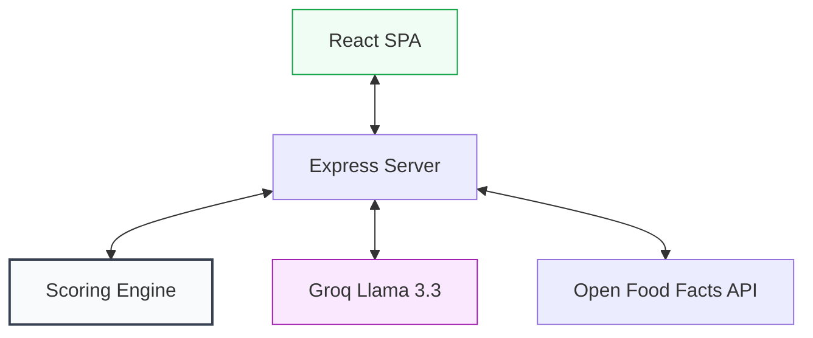

# 🏗️ KonbiniCompare

**The first-of-its-kind, deterministic scoring engine for Japanese convenience store products.**

KonbiniCompare is a bilingual decision-support tool designed for international residents and tourists in Japan. Unlike generic AI apps that "guess" nutrition, KonbiniCompare uses a **weighted normalization engine** to rank products based on user-defined priorities (Budget, Protein, Sugar, etc.) with 100% transparency.

---

## 🌟 Why KonbiniCompare?

- **Deterministic Logic**: Rankings are calculated by math, not LLM imagination.
- **Bilingual Insights**: AI-powered summaries explain the results in both Japanese and English.
- **Real-World Data**: Integrated with Open Food Facts and custom-curated Japanese product fixtures.
- **Privacy First**: No account required. All preferences stay in your browser.

---

## 📐 Architecture

The application is built as a TypeScript monorepo using `pnpm` workspaces.



### Request Flow: "Which one should I grab?"

```mermaid
sequenceDiagram
    actor User as 🛒 User in Konbini
    participant UI as React SPA
    participant API as Express API
    participant OFF as Open Food Facts
    participant Eng as Scoring Engine
    participant LLM as Groq LLM

    User->>UI: "Scan barcode or search"
    UI->>API: "GET /api/search?q=... or /api/barcode/:code"
    API->>OFF: "Fetch real product data"
    OFF-->>API: "nutrition, allergens, ingredients"
    API-->>UI: "merged local + OFF results"
    User->>UI: "Select 2–5 products, tap 'Compare'"
    UI->>API: "POST /api/quick-compare {productIds, profile, allergens}"
    API->>Eng: "score(products, preferences)"
    Note over Eng: 1. Normalize each dimension [0,1]<br/>2. Weight by profile + allergens<br/>3. Aggregate → rank<br/>4. Detect missing data penalty
    Eng-->>API: "ranked results + breakdown"
    API->>LLM: "Explain why this ranking, bilingual"
    LLM-->>API: "summaryJa, summaryEn"
    API-->>UI: "full ranked payload + AI explanation"
    UI-->>User: "Detailed bilingual analysis"
```

---
